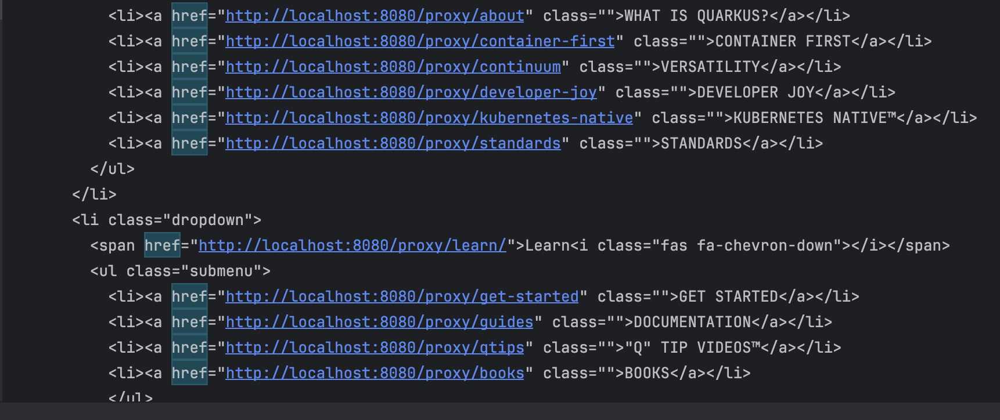

# vmedia

Write a "proxy" that will return the modified text of quarkus.io (or any other site of your choice);

•	To each word, which consists of six letters, you must add a symbol "™";

•	For the task you must use Quarkus framework;

•	The functionality of the original site must not be altered;

•	All internal navigation links of the site must be replaced by the address of the proxy-server.

That is, site navigation must be handled by a Proxy without taking the client back to the original site.

Example. A request to, say, {proxy address}/quarkus3/ should show the content of the page
https://quarkus.io/quarkus3/ with changed words that were 6 characters long.
And all the site navigation to sections of the site should go through Proxy.


## Running the application in dev mode

You can run application in dev mode by:

```shell script
./mvnw compile quarkus:dev
```

## Endpoint
Proxy endpoint (with localhost)
- `localhost:8080/proxy` - shows modified quarkus.io main page
- `localhost:8080/proxy/{path}` - navigates to modified quarkus.io/{path} page

## Solution Limitation

Due to lack of description, some corner cases were uncovered. 
Here a few of them:

1. Redirections in href were ignored, e.g. 
    ```
    <li><a href="https://github.com/orgs/quarkusio/projects/13/views/1" class="">ROADMAP</a></li>
    ```

2. No handling for endpoints that download contents, show icon and et cetera.
3. Ignored inconsistency in Quarkus' URI, e.g. for some URI trailing `/` is required, for another it shouldn't be present.

## Testing

Feel free to trigger tests (QuarkusProxyResourceIT) to reproduce simple proxy query.

Check logs for response example.

